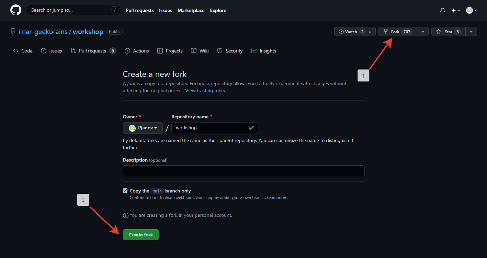
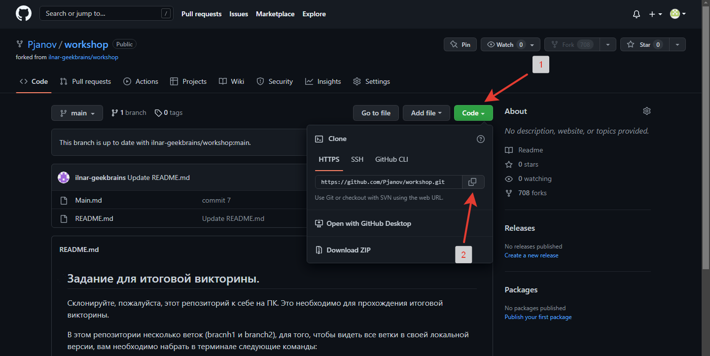
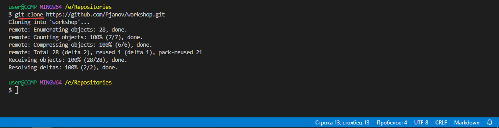
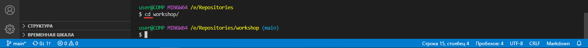
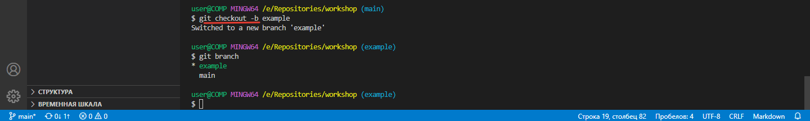
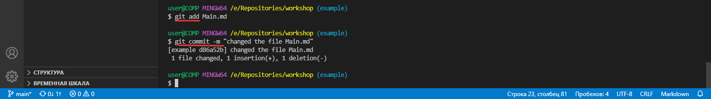
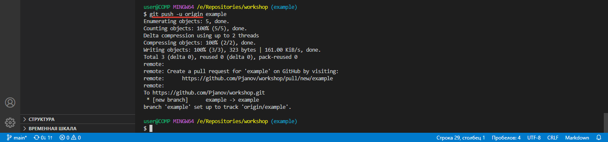
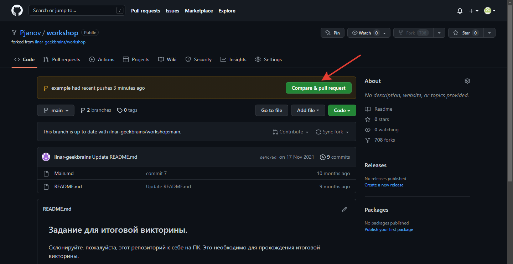
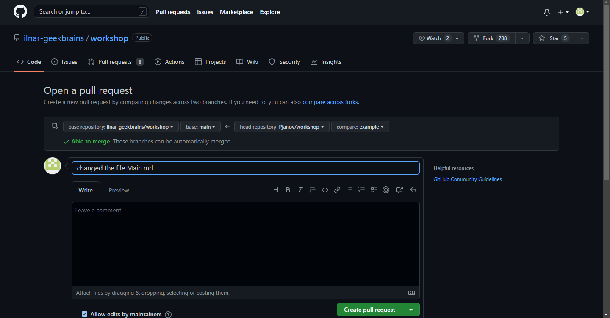
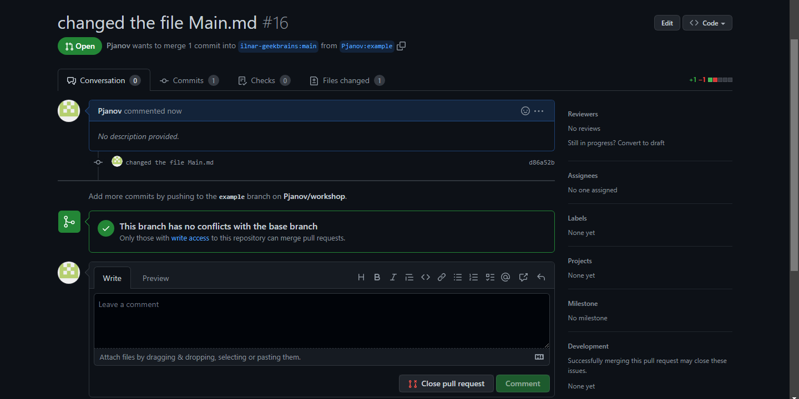

# Инструкция Pull-request с другого профиля

1. Для того чтобы сделать pull-request с другого профиля, необходимо зайти в этот репозиторий на GitHub и в правом верхнем углу нажать на значек вилки (1) затем нажать на зеленую кнопку **Create fork** (2).

2. После чего нас перекидывает на свой профиль в GitHub с копией этого репозитория, нажимаем на зелуную кнопку **Code** и копируем ссылку.

3. Затем открываем заранее подготовленную папку с помощью программы **Visual Studio Code**, создаем терминал и клонируем этот репозиторий с помощью команды: *git clone ссылка* 

4. После того как в вашей папке появилась новая папка с названием клонируемого репозитория, необходимо в нее перейти с помощью команды: *cd имя папки*

5. Обязательно создаем новую ветку с помощью команды: *git checkout -b имя ветки* и проверяем командой *git branch*

6. Вносим все необхобимые изменения только в этой ветке! Сохраняемся и делаем коммит.

7. Отлично!!! Теперь необходимо сделать пуш на удаленный репозиторий. И в этом поможет команда:*git push -u origin название ветки* 

8. Заходим на свой профиль в GitHub с названием этого репозитория и нажимаем на зеленую кнопку *Compare & pull request*

 

 9. И у нас автоматически открывается новый *pull-request* или запрос на слияние, здесь можно откоректировать данные по неоходимости и нажимаем зеленую кнопку *Create pull request* создаётся новый объект репозитория который доступен только на сервисе *GitHub*.

 

 10. Любой человек участвующий в разработке этого программного обеспечения может зайти в раздел 
 *pull request*, увидеть, что есть открытый *pull request* под нужным названием, зайти в него и посмотреть какие коммиты были сделаны,какие файлы были изменены и посмотреть, что конкретно в них изменилось.Если его что-то не устраивает он может оставить комментарий зайди во вкладку *Conversation* затем *write*, написать комментарий и нажать кнопку *Comment*

 

